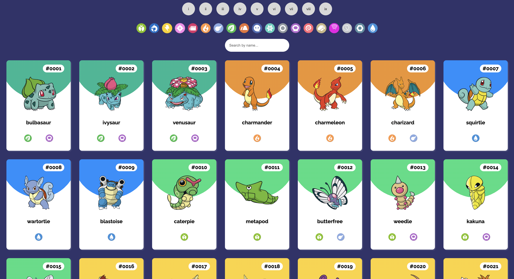

# PokeDex

Welcome to the PokeDEX! This is a web page where you can view information about different Pokemon, including their image, generation, and type. You can filter the Pokemon cards by generation and type, and search for specific Pokemon by name.

## Technologies Used

This PokeDEX page was created using the following technologies:

- JavaScript
- CSS
- HTML
  The PokeDEX page also fetches data from the PokeAPI, which is an open-source API that provides information about Pokemon.

## Features

Here are some of the features of the PokeDEX page:

- View Pokemon cards with image, generation, and type information
- Filter Pokemon cards by generation and type
- Search for specific Pokemon by name

### **Check it out!**

### Link to my GitHub

